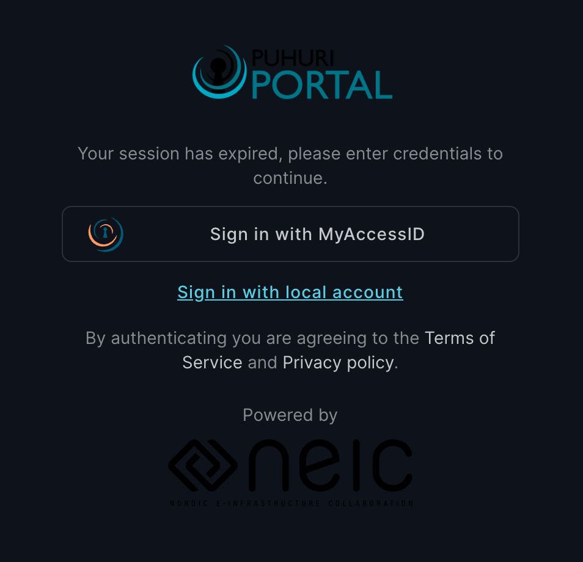
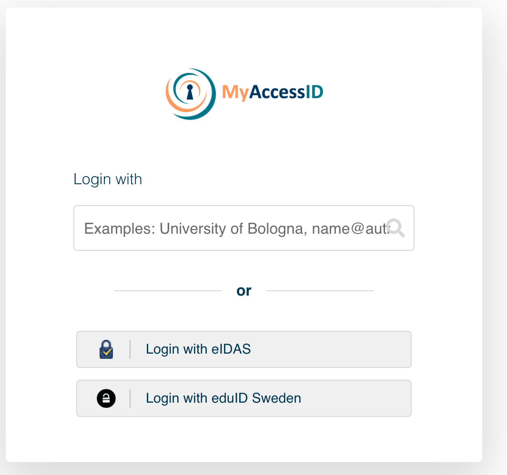
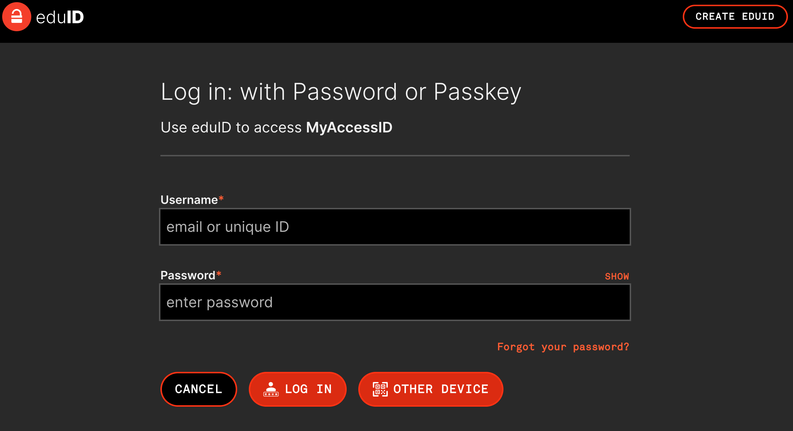

# Get Started

We will run the training on the [HPE Cray EX LUMI supercomputer](https://lumi-supercomputer.eu/), specifically the GPU partition (LUMI-G).
You can check the [LUMI documentation](https://docs.lumi-supercomputer.eu/firststeps/) to get familiar with the system.

In this document, we provide detailed instructions on how to access LUMI for the CUG tutorial on containers.
For logistics reasons, it is **highly recommended** that you start the procedure as soon as possible. Consider that it can take up to a day to get full access, so we cannot promise any access on the same day of the tutorial.

If you need assistance, please connect to the Slack channel [#cug2026-tutorial-1b](https://crayusers.slack.com/archives/C0AU57Y2SG5) of the CUG workspace.

*Note: If you have an existing LUMI account on Puhuri, you can skip steps 7-10* 

1. Provide us with your name and organizational email: reach us on Slack or send us an [email](mailto:alfio.lazzaro@hpe.com).
2. Wait until you receive an email that you have been invited to the project.
3. Click on the invite link, which will bring you to the Puhuri Portal (direct [link](https://puhuri-portal.neic.no/) access).
4. Click on "Sign in with MyAccessID", e.g.
<p align="center">
   
</p>

5. Click on "Login with eduID Sweden" (this is for users who do not have an academic identity or supported eIDAS digital identity, see [here](https://puhuri.neic.no/user_guides/myaccessid_registration/) for more details), e.g.
<p align="center">
   
</p>

6. Then you are forwarded to the eduID Sweden login page, where you can log in with an existing account or create a new one, e.g.
<p align="center">
   
</p>

7. For creating a new account, click on "CREATE EDUID" button at the top right corner. Please use your email and follow the instructions. **Please remember to use your organizational email, not your private one.**
    * You are asked to accept the eduID rules and prove you are a human.
    * After adding your email address to register, you will get a verification email with a code to verify your email address. You're asked to enter your first name, last name, and other relevant information. Required information may change over time. **There is NO need to put an ID number, mobile phone or anything else in the “identity” or “advanced settings” tabs.**
    * After finishing the registration, if everything is correct, you will be redirected back to MyAccessID to accept Terms of Use documents and Privacy Policies.
8. Now that you are registered to Puhuri via eduID Sweden, you should accept the invitation to the project that will appear on your account.
9. The next step is setting up SSH keys on the Puhuri Portal, see [here](https://puhuri.neic.no/user_guides/myaccessid-ssh-key/) for more details.
    * Login to the MyAccessID profile [management page](https://mms.myaccessid.org/fed-apps/profile/).
    * Click “Settings” from the left-side menu.
    * Click on “SSH Keys”.
    * Click on “New Key” and then add the public part of your SSH key and save the key by clicking “Add SSH key”.
    * You will receive an email with your `username`.
    * Key propagation to the service provider may take 1-2 hours.
10. Test the SSH connection: `ssh <username>@lumi.csc.fi`. If you get the following output, then you are all set! Type exit to end the SSH session.
```
 *  ▒▒▒▒▒▒▒▒▒▒▒▒▒▒▒▒▒▒▒▒▒▒▒▒▒▒▒▒▒▒▒▒▒▒▒▒▒▒▒▒▒▒▒▒▒▒▒▒▒▒  *   *      *  
                                                       *      *  *    
   * ████       ████   ████   █████▄    ▄█████   ████     *     *     
 *   ████       ████   ████   ████ █▄  ▄█ ████   ████         ,    *, 
     ████       ████   ████   ████  ████  ████   ████  *   *  |\_ _/| 
     ████       ████   ████   ████   ▀▀   ████   ████   *    .| ." ,| 
  *  ████       ████   ████   ████        ████   ████        /(  \_\) 
     ████       ████   ████   ████        ████   ████       /    ,-,| 
 *   ████▄▄▄▄▄  ▀███   ███▀   ████        ████   ████ *    * /      \ 
     █████████    ▀▀███▀▀     ████        ████   ████  * ,/  (      * 
 *                                                     ,/       |  /  
  * ▒▒▒▒▒▒▒▒▒▒▒▒▒▒▒▒▒▒▒▒▒▒▒▒▒▒▒▒▒▒▒▒▒▒▒▒▒▒▒▒▒▒▒▒▒▒▒▒▒▒/    \  * || |  
                 *              *               ,_   (       )| || |  
*   *    *    The Supercomputer of the North  * | `\_|   __ /_| || |  
        **               *            * *       \_____\______)\__)__) 
   .********----------*******-------******----------****************. 
....
```
11. Wait for the tutorial to start.
